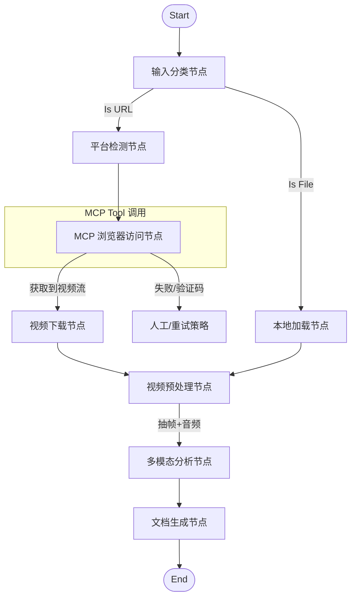

# 视频转 Word 智能体 (Video2Word Agent) - LangGraph 架构版

## 1. 项目概述
本项目构建一个基于 LangGraph 的智能体工作流，支持多平台视频（本地文件、B站、抖音、小红书）的自动化内容提取与文档生成。系统利用 MCP (Model Context Protocol) 工具进行网页访问，利用多模态大模型进行深度内容分析。

## 2. 核心架构：LangGraph 工作流

### 2.1 状态定义 (State)
```python
class AgentState(TypedDict):
    input_source: str      # 用户输入 (文件路径 或 URL)
    source_type: str       # 'local' 或 'url'
    video_path: str        # 视频在本地的物理路径
    platform: str          # 'bilibili', 'douyin', 'xiaohongshu', 'other'
    metadata: dict         # 视频标题、作者、发布时间等
    analysis_result: str   # LLM 分析出的 Markdown 内容
    screenshots: List[str] # 截图文件路径列表
    doc_path: str          # 最终生成的 Word 文档路径
    errors: List[str]      # 错误日志
```

### 2.2 图结构 (Graph Topology)


### 2.3 核心节点逻辑 (Nodes)

1.  **输入分类节点 (Input Classifier)**:
    *   判断 `input_source` 是 URL 还是本地路径。
    
2.  **MCP 浏览器访问节点 (MCP Browser Fetcher)**:
    *   **工具**: 调用 `playwright` MCP server。
    *   **逻辑**: 
        *   针对 **抖音/小红书**: 使用 `browser_navigate` 打开链接，等待页面加载。
        *   使用 `browser_evaluate` 或 `browser_network_requests` 嗅探 `<video src>` 或 m3u8 地址。
        *   同时提取页面元数据（标题、描述）。
    
3.  **视频下载节点 (Downloader)**:
    *   接收视频流 URL，下载到 `temp/` 目录。
    *   对于 B站，可视情况直接调用 `yt-dlp` (稳定性更高)。

4.  **视频预处理节点 (Processor)**:
    *   **关键帧提取**: 使用 `opencv` 基于场景变化率（Scene Change Detection）抽帧。
    *   **音频提取**: 分离音轨用于 Whisper 转录（可选，视 LLM 能力而定）。

5.  **多模态分析节点 (Analyzer)**:
    *   **模型**: Gemini 1.5 Pro (推荐) 或 GPT-4o。
    *   **输入**: 视频文件 + 抽取的关键帧图片 + Prompt。
    *   **Prompt**: "你是一个专业的笔记整理员。请根据视频内容生成详细的 Word 格式笔记。遇到板书或 PPT 重点时，请标记 `[INSERT_IMAGE: <timestamp>]`。"

6.  **文档生成节点 (Generator)**:
    *   解析 Markdown，将 `[INSERT_IMAGE: ...]` 替换为实际图片。
    *   使用 `python-docx` 生成最终文件。

## 3. 技术栈
*   **编排框架**: `langgraph`, `langchain`
*   **Web 界面**: `streamlit`
*   **MCP 集成**: `langchain-community` (用于连接 Playwright MCP)
*   **视频处理**: `yt-dlp` (B站下载), `opencv-python` (处理), `ffmpeg`
*   **AI 模型**: `google-generativeai` (Gemini SDK) 或 `openai`

## 4. 目录结构
```text
video_to_word/
├── app.py                  # Streamlit 前端
├── graph/
│   ├── __init__.py
│   ├── state.py            # State 定义
│   ├── graph_builder.py    # LangGraph 构建逻辑
│   └── nodes/              # 各个 Node 的具体实现
│       ├── classifier.py
│       ├── mcp_browser.py  # 封装 Playwright MCP 调用
│       ├── downloader.py
│       ├── analyzer.py
│       └── generator.py
├── tools/                  # 辅助工具函数
│   ├── video_utils.py
│   └── doc_utils.py
└── .env                    # API Keys